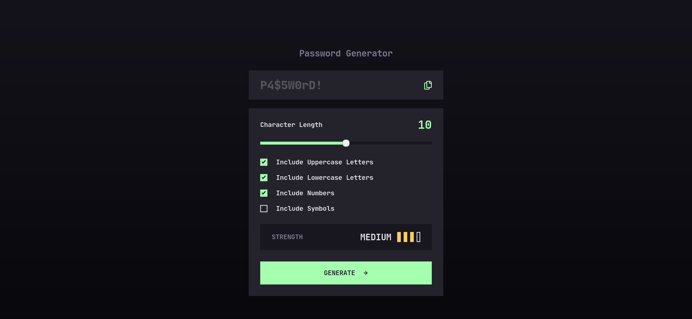

# Frontend Mentor - Password generator app solution

This is a solution to the [Password generator app challenge on Frontend Mentor](https://www.frontendmentor.io/challenges/password-generator-app-Mr8CLycqjh). Frontend Mentor challenges help you improve your coding skills by building realistic projects.

## Table of contents

- [Overview](#overview)
  - [The challenge](#the-challenge)
  - [Screenshot](#screenshot)
  - [Links](#links)
- [My process](#my-process)
  - [Built with](#built-with)
  - [What I learned](#what-i-learned)
  - [Continued development](#continued-development)
  - [Useful resources](#useful-resources)
- [Author](#author)

## Overview

### The challenge

Users should be able to:

- Generate a password based on the selected inclusion options
- Copy the generated password to the computer's clipboard
- See a strength rating for their generated password
- View the optimal layout for the interface depending on their device's screen size
- See hover and focus states for all interactive elements on the page

### Screenshot

### Links

- [Solution URL](https://github.com/iankakaruzia/password-generator-solid)
- [Live Site URL](https://password-generator-solid.vercel.app)

## My process

### Built with

- Semantic HTML5 markup
- TailwindCSS
- Flexbox
- Mobile-first workflow
- [Vite](https://vitejs.dev/)
- [SolidJS](https://www.solidjs.com/)

### What I learned

This was my first time working with SolidJS, so there was some shift of thinking, with the goal of learning more about the language.

### Continued development

I enjoyed working with SolidJS and Vite, and I'm excited to continue learning and building on these technologies.

### Useful resources

- [Generate Password Script](https://stackoverflow.com/a/68935403) - This helped me getting the generate script working.

## Author

- Frontend Mentor - [@iankakaruzia](https://www.frontendmentor.io/profile/iankakaruzia)
